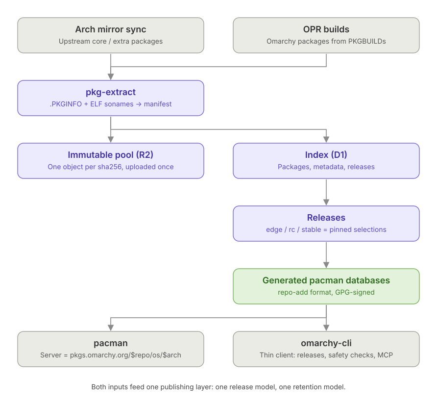
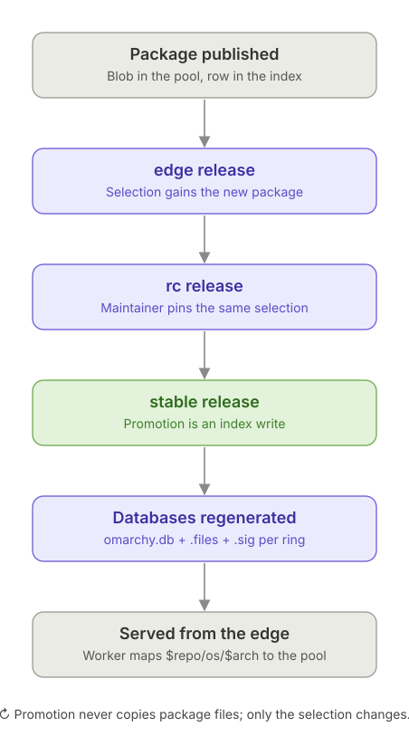
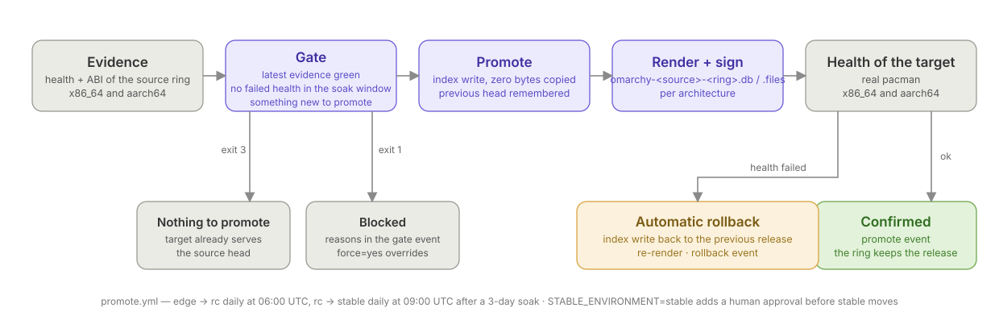
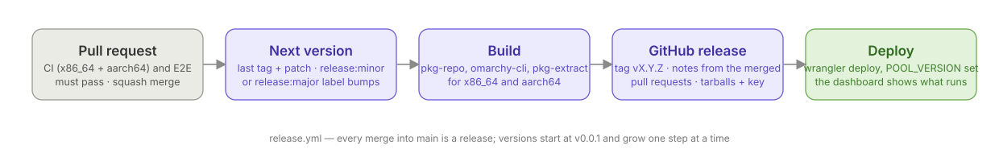
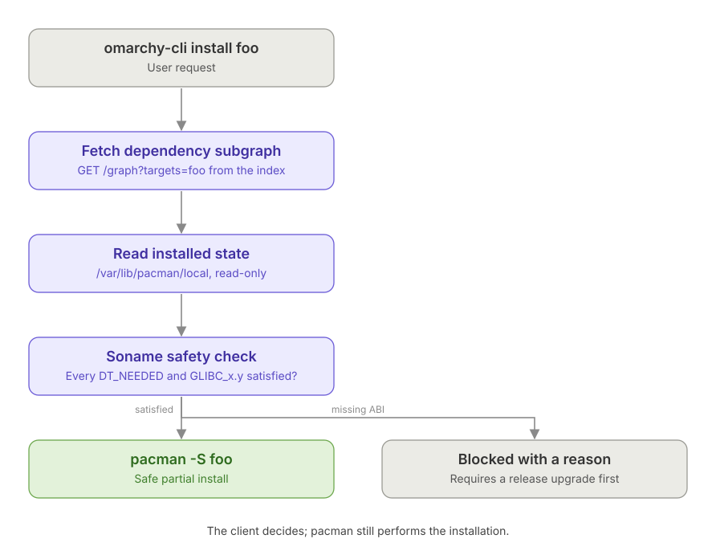

# Architecture

omarchy-pool is a package repository for Omarchy built on three ideas: an
**immutable package pool plus an index** that represents complete releases, **signed
pacman databases generated from that index**, and a **thin client** that
understands releases. It began as a proof of concept answering exactly those three
questions — the evidence is kept in [`poc/RESULTS.md`](../poc/RESULTS.md) — and now
runs as the staging environment at https://omarchy-pool.firemanxbr.org.

Packages are standard Arch `.pkg.tar.zst` archives produced by `makepkg`; they are never
modified. The deployment is a Cloudflare Worker + D1 + R2; the pipeline is a
queue of jobs in D1 that workers anywhere pull; GitHub hosts the code and
cuts the releases.

## The problem

Today `edge`, `rc` and `stable` are three complete directory trees (~275 GB each).
Promoting a release copies and re-uploads most of that data, so a bump takes
30–60 minutes even when almost nothing changed.

## The publishing layer

* **Pool** — Cloudflare R2, one object per package keyed by its SHA-256. A package is
  uploaded exactly once, whether it came from the Arch mirror sync or from an OPR build.
* **Index** — Cloudflare D1. Every package with its full metadata (from `.PKGINFO`
  plus the ELF soname graph extracted by `pkg-extract`) and every release.
* **Releases** — a release is a pinned selection of package ids for one ring
  (`edge`, `rc`, `stable`). Promotion creates a new release for the target ring that
  points at the same selection: an index write, no bytes move. Rollback is the same
  write pointing at an earlier selection; history is append-only. Stored as
  **deltas**: what a ring serves now lives in one table (`ring_packages`), a
  release writes only what it changed against its parent (`release_deltas`), and
  the full membership is written out for a *checkpoint* — the first release of a
  ring, then every 24th, and any older release read by id (a pinned page, a diff,
  a rollback target), reconstructed from the checkpoint behind it plus the deltas.
  A release costs hundreds of rows, not thirty thousand (migration 0017).
* **Generated pacman databases** — for each ring and source the publisher renders
  `omarchy-<source>-<ring>.db` and `.files` in `repo-add` format and uploads them;
  the Worker signs them with its own OpenPGP key (a secret that never leaves
  Cloudflare, `worker/src/signing.ts`) and stores them **beside the packages** (`<arch>/omarchy-core-stable.db`). pacman
  reads the bucket's custom domain directly — `Server = https://pool…/$arch` — and
  the only thing that differs between rings is the repository name. No worker, no
  redirect on the read path.

### Index schema (D1)

| table | purpose |
|---|---|
| `packages` | immutable rows keyed by `sha256`; `manifest_json` holds the full manifest |
| `package_provides` / `package_requires` / `package_files` | normalized graph for queries |
| `releases` | `(ring, seq)` with `created_at`, optional `parent_id`, a note, the stored summary (`package_count`, `bytes`, `sources`) and `checkpoint` |
| `ring_packages` | `(ring, package_id)` — what each ring serves now; every read of a head |
| `release_deltas` | `(release_id, package_id, op)` — what a release added or removed against its parent |
| `release_packages` | `(release_id, package_id)` — the full selection of checkpoint releases only |
| `ring_heads` | `ring → release_id` currently served |

Migrations live in `worker/migrations/`.

### Index API (Worker)

| Route | Purpose |
|---|---|
| `PUT /api/v1/pool/:sha256?filename=` · `…/multipart` | pool upload (R2 verifies the sha256; multipart for large archives) |
| `POST /api/v1/packages?source=core` | index a manifest with its provenance |
| `POST /api/v1/packages/known` | which sha256s the index already has (the sync's diff) |
| `GET /api/v1/version` · `/status` | running release; service check measured now (index and pool reachable, timings) — what *online* in the dashboard header means |
| `GET /api/v1/releases/:ring` · `/history` · `/diff?from=&to=&arch=` | current release, package list, lineage. `?fields=summary` is small; full manifests are paged (`?arch=&limit=≤1000&offset=&release_id=` — above 2000 packages an unpaged request is refused with 413, since a 15k-package ring with file lists exceeds one Worker invocation); `include=files` returns each file list still gzip-compressed (`files_gz`, base64) and the reader inflates it — 500 decompressed lists of chaotic-aur games per page exceeded the Worker |
| `POST /api/v1/releases` | create / promote / roll back a release (a job's token) |
| `PUT /api/v1/releases/:id/artifacts/:kind?repo=` | store a rendered database beside the packages |
| `GET /api/v1/graph?targets=a,b&ring=stable&arch=` | dependency closure for the client's safety check — follows declared dependencies through *declared* provides (`package_provides.declared`, from `.PKGINFO`), as pacman does; the sonames a binary loads or ships never route the closure (a package bundling its own libstdc++ is not a provider of `libstdc++.so`) |
| `GET /api/v1/security?ring=&arch=` · `PUT /security/advisories` · `PUT /security/matches` | open advisories on what a ring serves (per package: confidence, severity, KEV/EPSS, rings already serving a clean version, how many packages depend on it or load one of its libraries); the writes are the Security workflow's |
| `GET /api/v1/search?q=` · `/package/:name[/files]` | search within a ring; a package's versions per ring, manifest, forward edges (declared dependencies and loaded sonames resolved to providers) and reverse edges (declared, or by loading one of its libraries) — the package page and, later, CVE propagation |
| `GET /api/v1/pool/unreferenced` · `POST /api/v1/pool/gc` | retention: what the last N releases do not reference |
| `GET /api/v1/factory` · `POST /factory/{requests,enqueue,claim,jobs}` · `/factory/tasks/:id/{heartbeat,complete,fail,cancel,approve,reject}` · `/factory/tasks/:id/artifacts/<file>` · `/factory/{register,packages,workers,workers/self,groups,review,approvals,trust,me}` · `GET /api/v1/users/:login` · `GET /api/v1/cost` | the factory's brain: package requests, build tasks with leases, the workers pulling them, contributors and their packages, maintainers' approvals, jobs queued by hand, the daily cost estimate ([factory/README.md](../factory/README.md), [GOVERNANCE.md](GOVERNANCE.md)) |
| `POST /api/v1/events` · `GET /api/v1/events` · `GET /api/v1/stats` | activity log and the dashboard's data |
| `GET /` | the dashboard |

pacman never talks to the worker. The worker never resolves dependencies; it
serves data. Decisions are made by the publisher (`pkg-repo`) and the client.

### Staging pipeline (pulled jobs)

Every row below is a **pulled job**: the Worker's cron queues it in
`build_tasks` on this schedule (`JOB_KINDS`), a project worker runs it with a
per-job token, and a maintainer queues the same by hand (`pkg-repo job`).
Nothing of the pipeline runs on GitHub Actions.

| Job | Schedule | What it does |
|---|---|---|
| `sync` | every 3 hours, one task per architecture, one release per ring | `pkg-repo sync` for every source in its table — Arch `core`/`extra`/`multilib` (x86_64, from `mirror.omarchy.org`), Arch Linux ARM `core`/`extra`/`alarm` (aarch64), chaotic-aur (x86_64, optional repo, `--defer-to` the others so Arch and the OPR own any shared name) into `edge`; the OPR's own `edge`/`rc`/`stable` channels each into the matching ring (aarch64 has only `edge`); a filename the pool already holds with different bytes (the OPR rebuilds the same version per channel) keeps the stored object, noted in the journal — every package's upstream signature verified against that project's keyring before it enters the pool; then render the rings that changed (a sync that changes nothing creates no release; a release scoped to one architecture keeps the other's databases and artifact rows from its parent — `unchanged_arches` in the response — so an aarch64 sync no longer re-renders the 15k-package x86_64 `extra`) |
| `promote` | daily: edge→rc 06:00 UTC, rc→stable 09:00 UTC (one-day soak); or manual | evidence-driven (below): fresh health + ABI of the source ring on both architectures → gate → index write → the OPR channel of the target ring aligned (`packages` comes from the OPR's matching channel, not from the source ring) → render → health of the target → automatic rollback if that fails |
| `health` | daily, per ring and architecture | real pacman per ring and architecture: `-Sy`, list, signed download → `health` event |
| `gc` | weekly | delete pool objects the last 3 releases of every ring do not reference (7-day grace for imports in flight); prune the membership of releases outside retention and CVE metadata no advisory has mentioned for 90 days |
| `security` | every 3 hours | `pkg-repo security`: the Arch Security Tracker (exact matches on Arch's versions), the Debian Security Tracker (same upstream projects, only for CVEs Arch has no advisory for, `name-version` when Debian names a fixed version newer than ours, `name-only` while still open; names whose versions are an order of magnitude apart are treated as different projects), CISA KEV and EPSS, matched with the real `vercmp` against every object the rings serve and stored in the index; then the **fast-track**: a package with a confident open advisory (exact or name-version, medium or worse, or exploited in the wild) in `rc`/`stable` whose clean newer version `edge` already serves is pulled in as one release without the soak, rendered, health-checked on both architectures and rolled back if that fails |
| `enqueue` | hourly | the PKGBUILDs on `main` reconciled with what the factory built: every (package, architecture, version) without a task is queued at that commit |
| `rollback` | by hand only | a ring pointed at an earlier release, both architectures re-rendered |
| `audit` | when a community build is staged | the second agent ([GOVERNANCE.md](GOVERNANCE.md#the-second-agent)): a project worker whose owner set an agent key (Anthropic, OpenAI, Gemini or xAI) reads the staged PKGBUILD, log and `.PKGINFO`, asks its model for a structured review (`factory/bin/audit-pkgbuild`, `factory/prompts/audit.md`) and attaches `audit.json` / `audit.md` to the evidence; the Review page shows the verdict. Never taken by the hosted fallback |
| `build` | on approval, on merge, on a new upstream release | a package built in a fresh container: community trust on a contributor's worker into their staging workspace, project trust on a trusted worker into `edge` |
| metrics snapshot (`src/metrics.ts`) | every 30 minutes | taken by the Worker itself, no job: the pool's jobs of the last 7 days (runs, failures, worker minutes, per kind), builds, workers alive, pool totals and ring sizes, as a `metrics` event; the dashboard's charts and jobs table read from it |
| worker cron trigger | every 10 minutes | the pool's own scheduler: queues the jobs above when due, requeues expired leases, applies `factory/MAINTAINERS.toml`, reads package-request issues, checks upstreams for bumps (05:45), estimates the bill (06:30), starts the hosted fallback worker when pool jobs wait and no project worker is idle; see RUNBOOK |
| `ci.yml`, `e2e.yml` | every pull request | fmt, clippy, tests and the worker typecheck on x86_64 and aarch64; real pacman end to end through a local worker |
| `release.yml` | every merge into `main` | CI + E2E again on the merged commit, next version from the last tag (`v0.0.1`, `v0.0.2`, …), binaries for both architectures, GitHub release, `wrangler deploy` carrying `POOL_VERSION` — the dashboard shows what is running |

Every step posts an event; https://omarchy-pool.firemanxbr.org renders them.
Two workflows remain on GitHub besides CI and the release: `factory-update.yml`
(pull requests bumping the project's own recipes, reviewed by their group's
maintainers) and `pool-worker.yml` (the hosted fallback worker).
Operations, trust model and the kill switch are in [RUNBOOK.md](RUNBOOK.md).

#### Promotion by evidence, not by calendar

A promotion happens when the recorded evidence says the source ring is good,
and is undone automatically when the target ring turns out not to be:

1. **Evidence.** On both architectures, a real pacman syncs the source ring and
   downloads a signed package (`health` event), and `omarchy-cli` runs the
   ELF-level safety check on every upgrade the ring would apply to the official
   Arch / Arch Linux ARM base image (`abi` event, blockers = unsatisfiable symbol
   versions).
2. **Gate** (`pkg-repo gate`). Per architecture: the latest health of the source
   ring is recent and not an error; no health inside the soak window failed
   (0 days into `rc`, 1 day into `stable`: edge is upstream in real time, rc a day behind, stable a day behind rc) and the source ring's content has
   been there that long (the age of its last promotion; syncs of the OPR channel
   do not reset it); a recent ABI check found no blocker.
   A ring with nothing rendered for an architecture is not evidence against it.
   If the target already serves the source's head there is nothing to promote.
   The verdict and its reasons are a `gate` event.
3. **Promote, render, verify.** The index write records the previous head; the
   databases are rendered and signed for both architectures; the target ring gets
   the same health check on both.
4. **Automatic rollback.** If that health check fails, the ring is pointed back at
   the previous release (another index write), re-rendered, and a `rollback` event
   says which release failed and which one was restored. Otherwise a `promote`
   event confirms it.

Stable moves without a human: the evidence is the reviewer, and a maintainer
who disagrees queues a rollback.

#### Security: advisories with confidence, exposure through the graph

Every object a ring serves is matched against public advisories (`security.yml`,
tables `advisories`, `cve_meta`, `package_advisories`). Each match carries how
sure we are — **exact** (the Arch tracker knows Arch's version), **name-version**
(Debian fixed the same upstream project in a version newer than ours),
**name-only** (still open upstream; possibly affected) — and each CVE whether it
is exploited in the wild (KEV) and how likely exploitation is (EPSS). Arch is
authoritative: Debian only fills CVEs Arch has no advisory for, and a name whose
versions are an order of magnitude apart from Debian's (`keystone`: assembler vs
OpenStack) is treated as a different project.

Fixes travel faster than features: `pkg-repo fast-track` pulls a clean version
into `rc`/`stable` as soon as `edge` has it, with the same render → health →
rollback safety net as a promotion, and `omarchy-cli security` /
`omarchy-cli upgrade --security-only` let a machine apply just those.

Exposure is not stored: the index derives it from the same dependency and soname
graph the package page draws — a package is *exposed* when it declares a
vulnerable package or when one of its binaries loads a library the vulnerable
package provides (the stronger evidence). The Security page shows both per ring,
the package page shows the chain, and the graph marks the nodes.

### Architectures

A package row records `repo_arch`, the architecture of the upstream repository it
came from; it is the pool directory (`x86_64/…`, `aarch64/…`) and, with the name,
the replacement key inside a ring. `any` packages are per-upstream builds: Arch's
and Arch Linux ARM's `python-foo-1.0-1-any` are different objects in different
directories. A ring holds both architectures; `render --arch` emits one database
per source for that architecture.

## Extraction (`crates/pkg-extract`)

Out-of-band: the archive in the pool is byte-for-byte what `makepkg` produced.
For each package the extractor merges `.PKGINFO` with the ELF facts of every
shipped object (`DT_SONAME`, `DT_NEEDED`, `.gnu.version_r`) into a
`PackageManifest` (`crates/pkg-manifest`). Symbol versions collapse to the highest
per `(soname, namespace)` since `GLIBC_2.34` subsumes `GLIBC_2.14`.

The manifest carries everything `repo-add` puts in a `desc` file (`pkgbase`,
`builddate`, `packager`, `makedepends`, `filename`, …) so databases can be rendered
from the index alone.

## Database generation (`crates/pkg-repo`)

Renders a release into `repo-add`-compatible archives:

* `<repo>.db.tar.gz` — one `<name>-<version>/desc` entry per package;
* `<repo>.files.tar.gz` — the same plus a `files` entry;
* detached GPG signatures (`.sig`) for both.

Validation: an Arch container with `Server = https://pkgs.<domain>/$repo/os/$arch`
runs `pacman -Sy` and `pacman -Sp <pkg>` against the generated database. See
[TESTING.md](TESTING.md).

## Safety check (`crates/pkg-check`)

* `local::LocalDb` — the pacman local database, read-only: installed versions and
  `provides`.
* `abi::SystemAbi` — the shared libraries actually on disk and the symbol versions
  they define (`.gnu.version_d`).
* `check` — for every package the release would install, each `requires` rule is
  classified: satisfied by the plan itself, by an installed library/package, a
  **warning** (pacman must resolve it from another repository) or a **blocker**
  (a soname or symbol version this system does not have).

## Thin client (`crates/omarchy-cli`)

The client drives pacman rather than replacing it. What it adds:

* knows which **release** the machine is on and what the ring currently serves
  (`status`, `upgrade` pins pacman to that release);
* **safety check** before an out-of-band install: fetches the dependency subgraph,
  reads `/var/lib/pacman/local`, and refuses when a required soname or symbol
  version is not present on the system — the case that today produces a broken
  partial upgrade;
* mirror discovery and release notifications come from the index, not from
  `pacman -Sy` polling;
* exposes package and release information locally (MCP, later).

`vercmp` is a byte-for-byte port of `alpm_pkg_vercmp` so the client and pacman
always agree on ordering.

## Not on the product path

`poc/crates/pkg-store` (a redb state store plus a journaled, crash-safe filesystem
transaction — the engine that would let the client stop shelling out to pacman)
and `poc/crates/pkg-hooks` (libalpm `.hook` types) are built and tested but not
wired in: the thin client did not need them. They stay in the workspace so they
keep compiling; see [`poc/README.md`](../poc/README.md). Open work is in
[`TODO.md`](../TODO.md).
