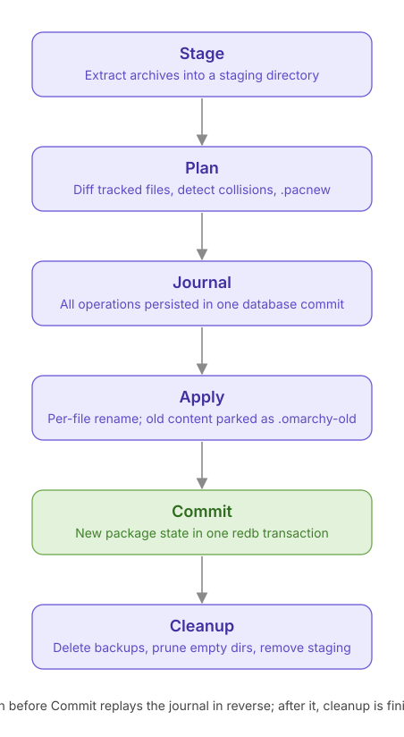

# Architecture

`omarchy-cli` is a proof of concept for the Omarchy repository migration. It answers
three questions:

1. Can an **immutable package pool plus an index** cleanly represent complete releases?
2. Can **valid, signed pacman databases** be generated from that index?
3. Does a **thin Omarchy client** give enough control to justify becoming part of the system?

Packages are standard Arch `.pkg.tar.zst` archives produced by `makepkg`; they are never
modified. Nothing here touches production.

## The problem

Today `edge`, `rc` and `stable` are three complete directory trees (~275 GB each).
Promoting a release copies and re-uploads most of that data, so a bump takes
30–60 minutes even when almost nothing changed.

## The publishing layer

* **Pool** — Cloudflare R2, one object per package keyed by its SHA-256. A package is
  uploaded exactly once, whether it came from the Arch mirror sync or from an OPR build.
* **Index** — Cloudflare D1. Every package with its full metadata (from `.PKGINFO`
  plus the ELF soname graph extracted by `pkg-extract`) and every release.
* **Releases** — a release is a pinned selection of package ids for one ring
  (`edge`, `rc`, `stable`). Promotion creates a new release for the target ring that
  points at the same selection: an index write, no bytes move.
* **Generated pacman databases** — for each ring the publisher renders
  `<repo>.db.tar.gz` and `<repo>.files.tar.gz` in `repo-add` format, signs them with
  GPG, and stores them in R2. pacman keeps working unchanged.

### Index schema (D1)

| table | purpose |
|---|---|
| `packages` | immutable rows keyed by `sha256`; `manifest_json` holds the full manifest |
| `package_provides` / `package_requires` / `package_files` | normalized graph for queries |
| `releases` | `(ring, seq)` with `created_at`, optional `parent_id` and a note |
| `release_packages` | `(release_id, package_id)` — the pinned selection |
| `ring_heads` | `ring → release_id` currently served |

Migrations live in `worker/migrations/`.

### Edge API (Worker)

| Route | Purpose |
|---|---|
| `GET /:ring/os/:arch/<repo>.db` (and `.files`, `.sig`) | pacman mirror: the generated database for the ring's current release |
| `GET /:ring/os/:arch/<filename>` | pacman mirror: resolves the filename in the release and streams the pool blob (Range supported) |
| `GET /api/v1/releases/:ring` | current release and its package list |
| `GET /api/v1/graph?targets=a,b&ring=stable` | dependency subgraph for the client's safety check |
| `PUT /api/v1/packages` | publish: pool upload + index rows (bearer token) |
| `POST /api/v1/releases` | create / promote a release (bearer token) |

The Worker never resolves dependencies; it serves data. Decisions are made by the
publisher (`pkg-repo`) and the client.

## Extraction (`crates/pkg-extract`)

Out-of-band: the archive in the pool is byte-for-byte what `makepkg` produced.
For each package the extractor merges `.PKGINFO` with the ELF facts of every
shipped object (`DT_SONAME`, `DT_NEEDED`, `.gnu.version_r`) into a
`PackageManifest` (`crates/pkg-manifest`). Symbol versions collapse to the highest
per `(soname, namespace)` since `GLIBC_2.34` subsumes `GLIBC_2.14`.

The manifest carries everything `repo-add` puts in a `desc` file (`pkgbase`,
`builddate`, `packager`, `makedepends`, `filename`, …) so databases can be rendered
from the index alone.

## Database generation (`crates/pkg-repo`)

Renders a release into `repo-add`-compatible archives:

* `<repo>.db.tar.gz` — one `<name>-<version>/desc` entry per package;
* `<repo>.files.tar.gz` — the same plus a `files` entry;
* detached GPG signatures (`.sig`) for both.

Validation: an Arch container with `Server = https://pkgs.<domain>/$repo/os/$arch`
runs `pacman -Sy` and `pacman -Sp <pkg>` against the generated database. See
[TESTING.md](TESTING.md).

## Thin client (`crates/omarchy-cli`)

The client drives pacman rather than replacing it. What it adds:

* knows which **release** the machine is on and what the ring currently serves
  (`status`, `upgrade` pins pacman to that release);
* **safety check** before an out-of-band install: fetches the dependency subgraph,
  reads `/var/lib/pacman/local`, and refuses when a required soname or symbol
  version is not present on the system — the case that today produces a broken
  partial upgrade;
* mirror discovery and release notifications come from the index, not from
  `pacman -Sy` polling;
* exposes package and release information locally (MCP, later).

`vercmp` is a byte-for-byte port of `alpm_pkg_vercmp` so the client and pacman
always agree on ordering.

## Future: native transaction engine (`crates/pkg-store`)

Built and tested, but not on the POC path. If the thin client proves itself, this
is the engine that would let it stop shelling out to pacman: a single redb state
file plus a journaled, crash-safe filesystem transaction.

## Roadmap

| Step | Deliverable | Answers |
|---|---|---|
| 1 ✅ | `pkg-extract`: manifest from unmodified archives; `index` for local repos | groundwork |
| 2 ✅ | `pkg-store`: redb + journaled transactions (parked) | future |
| 3 ✅ | Index schema with releases; `pkg-repo publish` / `promote`; worker API | Q1 |
| 4 ✅ | `pkg-repo render`: signed `repo-add` databases per release; worker mirror routes; validated with pacman 7.1 in a container, over `file://` and through the worker | Q2 |
| 5 | Thin `omarchy-cli`: `status`, `check`, `install`, `upgrade` over pacman | Q3 |
| 6 | libalpm hook compatibility, native engine wiring | later |
